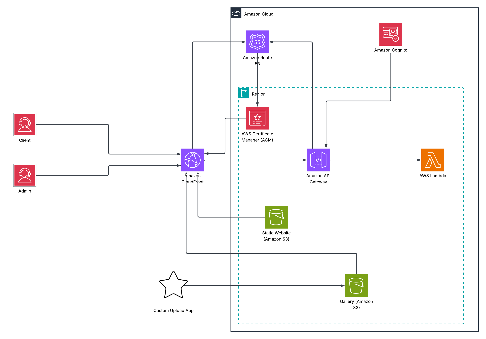

# Secure Photo Gallery on AWS (CloudFront + S3 + Lambda + DynamoDB + Cognito)

A production-style, serverless photo gallery for sharing client folders securely via expiring links and CloudFront signed cookies.  
Includes an admin portal to generate/revoke share links, and a public gallery UI.

---

## 🔥 What this project solves

Most “simple S3 photo sharing” breaks down fast:
- Anyone can list objects if you expose the bucket
- Share links can be copied/abused
- `/list` calls can hammer Lambda/S3 and increase cost
- You need a real way to **revoke** a shared link immediately

This project implements a clean architecture:
- **Admin generates share links** (JWT-protected)
- **Viewer opens share link** → Lambda validates token in DynamoDB → issues **CloudFront signed cookies**
- **Gallery UI lists + views photos** only if token is valid (and CloudFront cookies are present)
- **Admin can revoke links** instantly (deletes token in DynamoDB)

---

## 📦 AWS Services Used

- **Amazon S3** – stores photos + optional ZIP bundle  
- **Amazon CloudFront** – CDN + signed-cookie access control + caching  
- **AWS Lambda** – `/open`, `/list`, `/sign`, `/revoke`, `/admin/links`  
- **Amazon DynamoDB** – stores active share links + TTL cleanup  
- **Amazon Cognito** – admin authentication (Hosted UI + PKCE)  
- **Amazon API Gateway (HTTP API v2)** – routes + JWT authorizer  

---

## 🏗️ Architecture Overview

### Public Flow (Client)
1. Client receives a share link:  
   `https://gallery.example.com/open?t=<token>`
2. `/open` (public) validates token in **DynamoDB**:
   - checks token exists
   - checks link not expired
3. Lambda generates **CloudFront signed cookies** and redirects to gallery:
   - `/site/index.html?folder=<folder>&t=<token>`
4. Gallery frontend calls:
   - `/list?folder=<folder>&t=<token>`
5. Lambda:
   - validates token again
   - enforces folder match
   - lists S3 keys under: `gallery/<folder>/`
   - returns JSON with `files[]` and optional `zip`
6. CloudFront caches `/list` for ~5 minutes to reduce Lambda/S3 calls.

### Admin Flow
- Admin portal uses **Cognito Hosted UI (Auth Code + PKCE)**.
- Requests are made with `Authorization: Bearer <JWT>` to API Gateway routes:
  - `POST /sign` → create token + store in DynamoDB
  - `GET /admin/links` → list active tokens (Option A: Scan)
  - `POST /revoke` → delete token (disable link instantly)

---

### Security
- Private S3 bucket (not public)
- CloudFront signed cookies enforce object access
- `/open` and `/list` require valid token stored in DynamoDB
- Token expiration enforced
- Token revocation supported
- Admin endpoints protected via Cognito JWT authorizer

---

